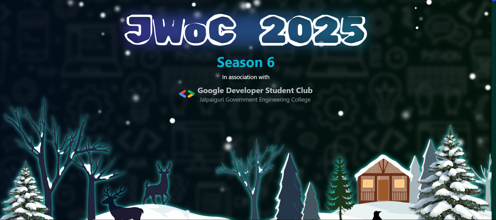

# <p align="center">🚀 Qrexel - Convert Everything into QR</p>

<i><p align="center">Welcome to <b>Qrexel</b>! Convert images, text, videos, files, and URLs into QR codes seamlessly.</p></i>

---


---

## ⭐ Repository Stats

<table align="center">
    <thead>
        <tr>
            <td><b>⭐ Stars</b></td>
            <td><b>🍴 Forks</b></td>
            <td><b>🐞 Issues</b></td>
            <td><b>✅ Open PRs</b></td>
            <td><b>❌ Closed PRs</b></td>
        </tr>
     </thead>
    <tbody>
         <tr>
            <td></td>
            <td></td>
            <td></td>
            <td></td>
            <td></td>
        </tr>
    </tbody>
</table>


##  Featured In
<table>
   <tr>
      <th>Event Logo</th>
      <th>Event Name</th>
      <th>Event Description</th>
   </tr>
   <tr>
        <td></td>
        <td><a href="https://www.jwoc.in">JWOC Season 6 2025</a></td>
       <td><p>WoC introduces students to open-source through mentorship and hands-on coding. The best projects are selected, and winners are chosen based on their contributions.</p></td>
    </tr>
   
</table>

---

## 🚀 Tech Stack

- **Frontend**: React.js, Vite, TypeScript, Tailwind CSS
- **State Management**: React Context API / Zustand
- **QR Code Generation**: `qrcode` package
- **Linting & Formatting**: ESLint, Prettier

---


## 🛠 How to Contribute

1. **Star the Repository:** Starring the repository is appreciated and helps increase visibility.
2. **Fork the Repository**
3. **Clone the Repository:**
   ```bash
   git clone https://github.com/<your-github-username>/qrexel.git
   ```
4. **Navigate to Project Folder:**
   ```bash
   cd qrexel
   ```
5. **Install Dependencies:**
   ```bash
   npm install  # Install frontend dependencies
   ```
6. **Run the Application:**
   ```bash
   npm run dev  # Start the development server
   ```
7. **Make Your Changes & Commit:**
   ```bash
   git checkout -b <your-feature-name>
   git add .
   git commit -m "Added new feature"
   git push origin <your-feature-name>
   ```
8. **Create a Pull Request on GitHub.**

---

## 📌 Contribution Guidelines

To maintain a well-organized repository, please follow these guidelines:
- **Maintain  proper file structure.**
- **Follow proper naming conventions.**
- **Ensure your code is properly formatted and documented.**
- **Test your changes before submitting a PR.**

---

## 🎉 Contributors

<a href="https://github.com/dinesh-2047/qrexel/graphs/contributors">
   
</a>

---

## 📜 Code of Conduct

We strive to make this project welcoming for all contributors. Please be respectful and follow our contribution guidelines.
